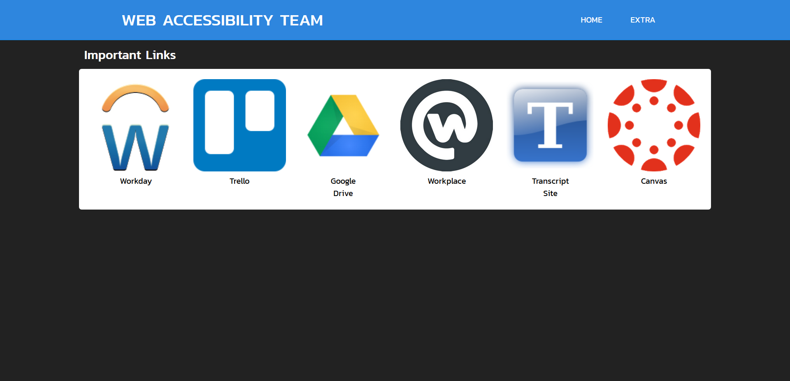

<!DOCTYPE html>
<html lang="en">
<head>
  <meta charset="UTF-8">
  <meta name="viewport" content="width=device-width, initial-scale=1.0">
  <link href="style.css" type="text/css" rel="stylesheet">
  <title>Brandon Bennett ePortfolio</title>
</head>
<body>
  <header>
    <nav>
      <a href="index.html"><h1>Brandon Bennett</h1></a>
      <ul>
        <li><a href="about.html">ABOUT</a></li>
        <li><a href="resume.html">RESUME</a></li>
        <li><a href="contact.html">CONTACT</a></li>
      </ul>
    </nav>
  </header>
  <main>
    

      <h2>Projects</h2>
      
I am an avid web developer and find lots of joy in creating beautiful websites. These are some 
        of the websites I've designed.
      
 
      
      
      
I have learned a lot about HTML5, CSS and JavaScript

    

  </main>
  <footer>

  </footer>  
</body>
</html>
